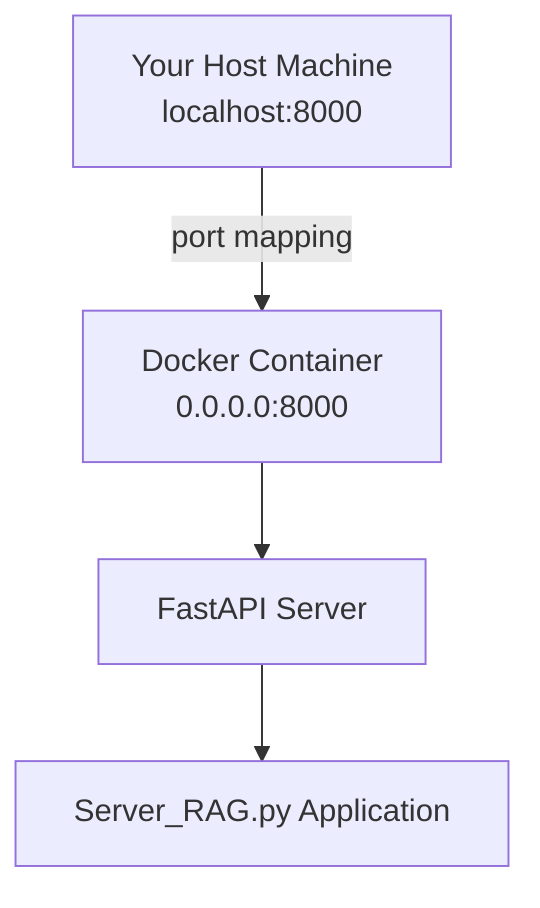

# Patent RAG Application - Docker Setup Instructions

## Overview

This document provides comprehensive instructions for setting up and running the Patent RAG (Retrieval-Augmented Generation) application using Docker with GPU acceleration.

## Architecture

The application consists of:
- **Patent Document Processing**: PDF text and image extraction
- **Vector Database**: Qdrant for semantic search
- **LLM Integration**: Ollama with LLaMA and LLaVA models
- **GPU Acceleration**: CUDA support for enhanced performance

## Docker Image Configuration

### Base Image
```dockerfile
FROM pytorch/pytorch:2.2.2-cuda12.1-cudnn8-devel
```

**Specifications:**
- **OS**: Ubuntu 24.04 (Debian-based)
- **CUDA Version**: 13.0.0
- **cuDNN**: Development version for deep learning
- **Python**: 3.x with pip support

### Build Process
1. **System Dependencies**: Install Python, build tools, and graphics libraries
2. **Python Environment**: Configure virtual environment and install dependencies
3. **Ollama Installation**: Download and configure Ollama for LLM inference
4. **Model Download**: Pre-download LLaMA and LLaVA models during build
5. **Application Setup**: Copy application files and configure startup script

## GPU Configuration

### Prerequisites
The host system must have:
- **NVIDIA GPU**: Compatible with CUDA 13.0
- **NVIDIA Drivers**: Latest stable version
- **NVIDIA Container Toolkit**: Required for Docker GPU access

### NVIDIA Container Toolkit Installation

**Purpose**: Enables GPU acceleration within Docker containers by providing runtime components and libraries to interface with NVIDIA GPUs.

**Installation Steps**:
1. Add NVIDIA package repositories
2. Install `nvidia-docker2` package
3. Restart Docker daemon
4. Verify installation with `docker run --gpus all nvidia/cuda:12.1-base-ubuntu22.04 nvidia-smi`

**Official Documentation**: [NVIDIA Container Toolkit Installation Guide](https://docs.nvidia.com/datacenter/cloud-native/container-toolkit/latest/install-guide.html)

### Docker GPU Access
```bash
# Run container with GPU access
docker run --gpus all -v $(pwd):/app patent-rag:v1.0

# Using docker-compose
docker-compose up --build
```

## Application Components

### 1. Document Processing
- **PyMuPDF**: PDF text extraction
- **EasyOCR**: Image text recognition
- **OpenCV**: Image processing and analysis

### 2. Vector Database
- **Qdrant**: High-performance vector similarity search
- **Sentence Transformers**: Text embedding generation

### 3. LLM Integration
- **Ollama**: Local LLM inference engine
- **LLaMA 3**: Text generation model
- **LLaVA**: Multimodal (text + image) model

## API Integration

### FastAPI Server Implementation
The application will be enhanced with a FastAPI server to enable:
- **RESTful API**: HTTP endpoints for patent processing
- **Remote Invocation**: Trigger processing from external systems
- **File Upload**: Accept patent PDFs via API requests
- **Result Retrieval**: Return processed results via JSON responses

**Implementation Plan**:
```python
# Example API structure
@app.post("/process_patent")
async def process_patent(pdf_path: str):
    return await main(pdf_path)

@app.get("/health")
async def health_check():
    return {"status": "healthy"}
```

## Container Registry

### GitHub Container Registry Setup
To enable public access to the Docker image:

1. **Repository Configuration**:
   - Enable GitHub Actions for automated builds
   - Configure secrets for registry authentication
   - Set up automated testing and validation

2. **Image Publishing**:
   - Tag images with semantic versions
   - Push to GitHub Container Registry
   - Document usage instructions

3. **Public Access**:
   - Make repository public
   - Provide pull instructions
   - Include example usage

### Usage Instructions
```bash
# Pull from GitHub Container Registry
docker pull ghcr.io/username/patent-rag:latest

# Run with GPU support
docker run --gpus all -v $(pwd):/data ghcr.io/username/patent-rag:latest
```

## Development Workflow

### Local Development
1. **Build Image**: `docker build -t patent-rag:v1.0 .`
2. **Run Container**: `docker run -it --gpus all -v $(pwd):/app patent-rag:v1.0`
3. **Interactive Mode**: Access bash shell for debugging
4. **Volume Mounting**: Mount local files for development

### Production Deployment
1. **Image Optimization**: Multi-stage builds for smaller images
2. **Security**: Non-root user, minimal dependencies
3. **Monitoring**: Health checks and logging
4. **Scaling**: Container orchestration with Kubernetes

## Troubleshooting

### Common Issues
1. **GPU Not Detected**: Verify NVIDIA Container Toolkit installation
2. **Model Download Failures**: Check network connectivity and disk space
3. **Memory Issues**: Adjust container memory limits for large models
4. **Permission Errors**: Ensure proper file permissions and user configuration

### Debug Commands
```bash
# Check GPU access
nvidia-smi

# Verify Ollama installation
ollama --version

# List downloaded models
ollama list

# Check container logs
docker logs <container_id>
```

## Performance Considerations

### GPU Utilization
- **Memory**: LLaVA model requires ~8GB GPU memory
- **Batch Processing**: Optimize for multiple patent processing
- **Caching**: Implement result caching for repeated queries

### Optimization Strategies
- **Model Quantization**: Use quantized models for faster inference
- **Parallel Processing**: Process multiple documents concurrently
- **Resource Limits**: Set appropriate CPU and memory limits

## Security Considerations

### Container Security
- **Non-root User**: Run application as non-privileged. 
   followed the docker post installation steps. 
   basically we add a group by: 
   ```bash

   sudo groupadd docker 

   ```

   then adding the user by:

   ```bash 

   sudo usrmod -aG docker $USER
user
- **Image Scanning**: Regular vulnerability scanning
- **Dependency Updates**: Keep dependencies updated
- **Network Security**: Restrict container network access

### Data Privacy
- **Local Processing**: All processing occurs within container
- **No External Calls**: Models run locally without internet dependency
- **Data Isolation**: Proper volume mounting and cleanup


After installing nvidia drivers and docker cuda toolkit we had to modify the daemon.json to use the Default Runtime as nvidia instead of runc:

sudo bash -c 'cat >/etc/docker/daemon.json' <<'JSON'
{
  "default-runtime": "nvidia",
  "runtimes": {
    "nvidia": { "path": "nvidia-container-runtime", "runtimeArgs": [] }
  }
}
JSON


Container run but failed at evaluation part:
the cosine_similarity of sklearn expected numpy arreys (embeddings of prompt and answer), instead got Pytorch tensors, seince we use device='cuda' now... , we had to convert it to .cpu().numpy(), the convertion from Pytorch tensors.


differences between running CUDA from host in general vs cuda base image: 
The host lack of:
   - CUDA runtime libraries;
   /usr/local/cuda/lib64/
   ├── libcudart.so.12.1.105    # CUDA runtime
   ├── libcublas.so.12.1.3.52   # CUDA BLAS
   ├── libcurand.so.10.3.2.106  # CUDA random
   ├── libcudnn.so.8.9.2.26     # cuDNN
   ├── libcufft.so.11.0.2.54    # CUDA FFT
   └── libcusolver.so.11.4.5.107 # CUDA solver
   - CUDA Headers and Development Files
   /usr/local/cuda/include/
   ├── cuda_runtime.h
   ├── cublas_v2.h
   ├── cudnn.h
   └── ...

Next create FastAPI server with POST enpoint that invoke main().
   - learn about passing data from client ( Body / BaseModel).

Check installation instruction ( official nvidia drivers installation, cuda container toolkit )
Make patent consume inputs from rag_inputs dir.
Try running Server from the container.

Server Start: 
   fastapi dev Server_RAG.py

Checking client POST request:
   curl -X POST "http://127.0.0.1:8000/process_patent" -H "Content-Type: application/json" -d '{"pdf_path": "US6285999.pdf"}'

## Docker Networking and Port Mapping

### Critical Difference: EXPOSE vs -p Flag

> **⚠️ IMPORTANT**: There's a crucial difference between `EXPOSE 8000` in Dockerfile and `-p 8000:8000` in docker run command

#### EXPOSE 8000 (in Dockerfile)

- **Documentation only**: Tells users which ports the container will use
- **No actual port mapping**: Doesn't make the port accessible from outside
- **Metadata**: Just adds information to the image metadata

**What it doesn't do:**
- ❌ Doesn't open the port
- ❌ Doesn't make it accessible from host
- ❌ Doesn't create any network mapping

#### -p 8000:8000 (docker run command)

- **Actual port mapping**: Maps host port 8000 to container port 8000
- **Network access**: Makes the port accessible from outside the container
- **Functional**: Actually allows external connections

**What it creates:**
- ✅ Host can access container on localhost:8000
- ✅ External machines can access via host IP:8000
- ✅ Real network connectivity

### Real Examples

#### With EXPOSE only
```dockerfile
EXPOSE 8000
```
```bash
docker run patent-rag-cuda:v1.1
# Result: Port 8000 is NOT accessible from outside
```

#### With -p flag
```bash
docker run -p 8000:8000 patent-rag-cuda:v1.1
# Result: Port 8000 IS accessible from outside
```

#### With both
```dockerfile
EXPOSE 8000
```
```bash
docker run -p 8000:8000 patent-rag-cuda:v1.1
# Result: Port 8000 is accessible AND documented
```

### Why Use Both

| Component | Purpose | Function |
|-----------|---------|----------|
| **EXPOSE 8000** (in Dockerfile) | Documentation | Tells users which ports to map |
| **-p 8000:8000** (in docker run) | Actual functionality | Makes the port accessible |

> **💡 Key Point**: EXPOSE is documentation, -p is the actual port mapping that makes it work.

### Network Commands for Linux Host Machine

#### Basic Network Information

| Command | Description | Output |
|---------|-------------|---------|
| `ip addr show` or `ip a` | Show all network interfaces | Interface details with IP addresses |
| `ip addr show up` | Show only active interfaces | Active interfaces only |
| `ip link show` | Show interface statistics | Interface status and statistics |
| `ip route show` | Show routing table | Network routing information |

#### IP Address Commands

```bash
# Show your main IP address
hostname -I

# Show external IP address
curl ifconfig.me

# Show local IP address
ip route get 1.1.1.1 | awk '{print $7; exit}'
```

#### Port and Service Commands

```bash
# Check if port 8000 is listening on your host
netstat -tlnp | grep 8000
# or
ss -tlnp | grep 8000
```

#### Docker-Specific Network Commands

```bash
# Show Docker Networks
docker network ls

# Show Docker Network Details
docker network inspect bridge

# Show Container IP Addresses
docker inspect <container_name> | grep IPAddress
```

### API Access Commands

#### From Host Machine (localhost)
```bash
curl -X POST "http://localhost:8000/process_patent" \
     -H "Content-Type: application/json" \
     -d '{"pdf_path": "US6285999.pdf"}'
```

#### From Another Machine on Network
```bash
# Use your host machine's IP address
curl -X POST "http://YOUR_HOST_IP:8000/process_patent" \
     -H "Content-Type: application/json" \
     -d '{"pdf_path": "US6285999.pdf"}'
```

#### Health Check
```bash
curl -X GET "http://localhost:8000/health"
```

### Network Flow Diagram



### Docker Compose Example

```yaml
# docker-compose.yml
services:
  app:
    build: .
    ports:
      - "8000:8000"  # This maps the exposed port
```

> **⚠️ Critical Point**: Without `-p 8000:8000`, your container's port 8000 would not be accessible from outside, even if you have `EXPOSE 8000` in the Dockerfile.


